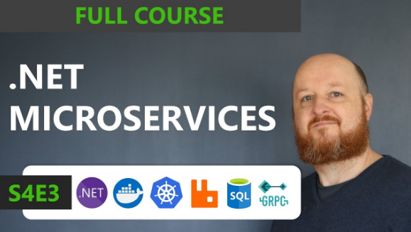

<h2 dir="rtl" align="center">
بسم الله الرحمن الرحيم
</h2>

# .NET Microservice
Welcome to my repository for the .NET Microservice! 

This repository is based on the following microservices course by [Les Jackson](https://au.linkedin.com/in/binarythistle)

<h2 dir="rtl" align="center">

</h2>

## Why This Repository Is HelpFul

- Each section of the course corresponds to a commit in this repository. This way, you can easily navigate through the different stages of the course and see the progression of the project.

- You have file that contains Commands Used In Each Section of the cource  
  [file Link](./RelatedDocuments/CommandsUsedInEachSection.md)

- Also you have file that contains How to run the project  
 [file Link](./RelatedDocuments/HowToRunTheProject.md)

- Postman collection of all endpoints used in the course  
 [Coollection Link](./RelatedDocuments/.NETMicroservices.postman_collection.json)

## Acknowledgments

- Thanks to the creators of the .NET Microservice course  [Les Jackson](https://au.linkedin.com/in/binarythistle) for providing such a valuable resource

