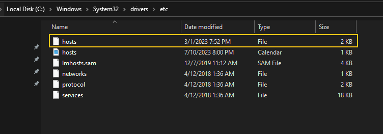
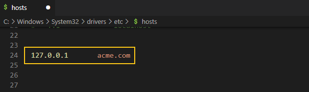
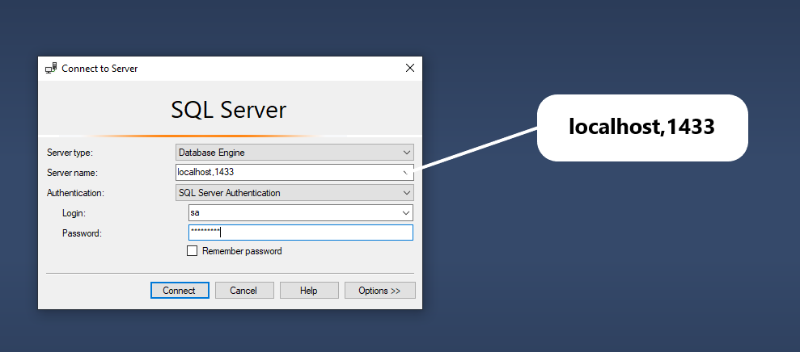

## Platform Service
```bash
dotnet build
dotnet ef migrations add InitialMigration
docker build --tag mohamedhashish/platformservice .
```

## Command Service
```bash
dotnet build
docker build --tag mohamedhashish/commandsservice .
```

## K8S
### Deploy the Platform service
```bash
kubectl apply --filename platforms-deal.yaml
kubectl apply --filename platforms-np-srv.yaml
```

### Deploy the Platform service
```bash
kubectl apply --filename commands-depl.yaml
```

### Adding an API Gateway
```bash
kubectl apply -f https://raw.githubusercontent.com/kubernetes/ingress-nginx/controller-v1.8.1/deploy/static/provider/aws/deploy.yaml
```




```bash
kubectl apply -f ingress-srv.yaml
```

### Starting With SQL Server
```bash
kubectl apply -f local-pvc.yaml
kubectl create secret generic mssql --from-literal=SA_PASSWORD="pa55w0rd!"
kubectl apply -f mssql-plat-depl.yaml
```
Now you can access SQL Server via Management Studio like the following   



### Message Bus & RabbitMQ
```bash
kubectl apply -f rabbitmq-depl.yaml
```
